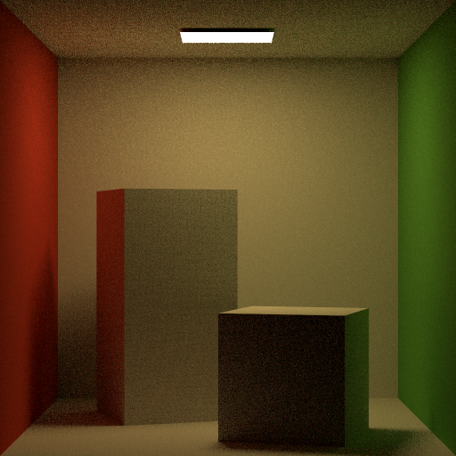

# Phosphor

Phosphor is a basic path tracer written to learn Rust and rendering

## Building

Phosphor requires [Rust](https://www.rust-lang.org) and [Embree](https://www.embree.org/) to build.
On Windows the environment variable EMBREE_DIR will need to be set to the directory Embree is installed in.